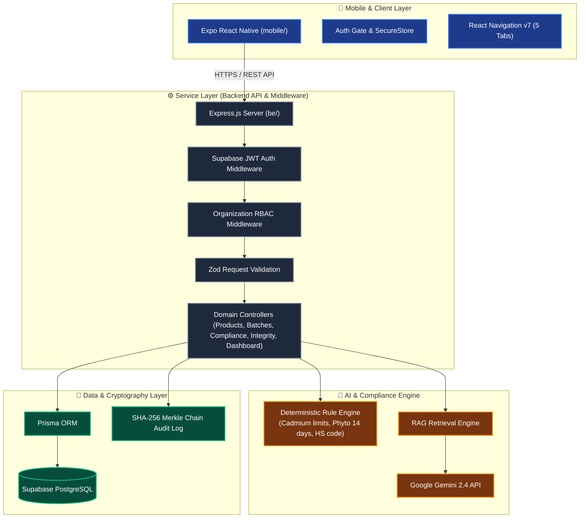

# 🏛️ Themis LexiGuard — Backend & Mobile AI Compliance Navigator
## KADA Module 3: Backend Services & Mobile Native Application


> **"Biến rào cản pháp lý thành lợi thế cạnh tranh xuất khẩu"**  
> **Themis LexiGuard** là giải pháp Backend API & Ứng dụng Di động Native hỗ trợ doanh nghiệp xuất khẩu nông sản (**Sầu riêng tươi xuất khẩu sang thị trường Trung Quốc theo Nghị định thư Hải quan GACC — Mã HS: 0810.60.00**) tự động hóa quá trình giám sát rủi ro thực địa, số hóa 4 Khóa chứng từ sống còn và kiểm định tính bất biến với chuỗi băm SHA-256 Merkle Chain.

---

## 👥 Đội Ngũ Thực Hiện Dự Án (Team Members)

| STT | Họ và Tên | Vai trò | Trách nhiệm chính |
| :---: | :--- | :--- | :--- |
| 1 | **Phạm Thành Long** | 👑 **Nhóm trưởng / Tech Lead** | Kiến trúc hệ thống, điều phối Backend & Mobile, tích hợp Gemini AI Engine. |
| 2 | **Đàm Công Tú** | **QA / Business Analyst** | Đặc tả nghiệp vụ (`business.md`), xây dựng kịch bản kiểm thử thực địa. |
| 3 | **Chăm Rốch Thi** | **Mobile Core Engineer** | Xây dựng kiến trúc React Navigation v7, Auth Gate, Quản lý Sản phẩm & Lô hàng. |
| 4 | **Huỳnh Hoàng Quân** | **Mobile Data & UI** | Thiết kế Design Tokens, Ra-da Điều hành GACC, Giám sát Liêm chính SHA-256. |
| 5 | **Nguyễn Tiến Thành** | **Backend API & DB** | Xây dựng RESTful API Express, Prisma ORM, phân hệ Lô hàng & 4 Khóa chứng từ. |
| 6 | **Hà Anh Tuấn** | **Backend Services & Security** | Supabase JWT Auth Middleware, phân quyền RBAC, Audit Log bất biến. |

---

## 📖 Bối Cảnh Nghiệp Vụ (Business Domain: Durian × GACC China)

Để xuất khẩu sầu riêng tươi chính ngạch sang Trung Quốc, doanh nghiệp xuất khẩu phải vượt qua **4 Khóa Pháp lý Sống còn**:

1. 🧪 **Khóa 1 — Phiếu Lab Cadmium (GB 2762-2022):** Giới hạn tối đa Cadmium trong quả sầu riêng là $\le 0.05\text{ mg/kg}$. Hệ thống tự động cảnh báo sớm khi chỉ tiêu đạt từ $0.040\text{ mg/kg}$.
2. 📄 **Khóa 2 — Kiểm dịch Thực vật (Phytosanitary Certificate):** Cấp bởi Cục BVTV, xác nhận không nhiễm rệp sáp, ruồi đục quả, hiệu lực tối đa **14 ngày**.
3. 📜 **Khóa 3 — Chứng nhận Xuất xứ C/O Form E:** Hồ sơ chứng minh nguồn gốc ASEAN - Trung Quốc để hưởng thuế suất ưu đãi ACFTA 0%.
4. 📦 **Khóa 4 — Packing List & Mã PUC/PHC (Lệnh 248/249):** 100% thùng hàng 15kg in song ngữ thể hiện đúng Mã số vùng trồng (PUC) và Mã cơ sở đóng gói (PHC) được GACC phê duyệt.

---

## 📱 Giao Diện Ứng Dụng Di Động Thực Tế (Mobile App Screenshots)

| 1. Ra-da & Điều Hành | 2. Thêm Sản Phẩm & PUC | 3. Trợ Lý AI Navigator |
| :---: | :---: | :---: |
|  |  |  |
| **Ra-da Pháp Lý & Cảnh Báo Cadmium**<br>Ngưỡng GB 2762 $\le 0.05\text{ mg/kg}$, Hạn Phyto 14 ngày & Lưới KPI 2x2 | **Quản Lý Danh Mục Sản Phẩm**<br>Thêm sản phẩm, Mã HS GACC `0810.60.00`, Vùng trồng PUC | **Trợ Lý AI Thực Địa**<br>Hỏi đáp quy chuẩn GACC 2024, Lệnh 248/249, Cadmium GB 2762 |

<br/>

| 4. Giám Sát Liêm Chính SHA-256 | 5. Cài Đặt & Phân Quyền RBAC |
| :---: | :---: |
|  |  |
| **Bảo Vệ Toàn Vẹn 100% SHA-256**<br>Công cụ Verify mã băm tức thì & Dòng thời gian Audit Trail | **Hồ Sơ & Doanh Nghiệp**<br>Thông tin Doanh nghiệp XNK, Mã số thuế & Phân quyền Chủ sở hữu |

---

## 🔐 Cơ Chế Chống Giả Mạo & Chuỗi Băm SHA-256 (Anti-Tampering Architecture)

Hệ thống Themis LexiGuard áp dụng cơ chế **Kẹp chì Số hóa (Cryptographic Sealing)** kết hợp chuỗi liên kết băm **SHA-256 Merkle Chain** để ngăn chặn 100% rủi ro chỉnh sửa số liệu kết quả Lab Cadmium, tẩy xóa ngày kiểm dịch Phyto hoặc mạo danh mã vùng trồng PUC khi xuất khẩu sang Hải quan Trung Quốc.

```mermaid
flowchart TD
    classDef blueBox fill:#1E3A8A,stroke:#3B82F6,stroke-width:2px,color:#FFFFFF;
    classDef amberBox fill:#78350F,stroke:#F59E0B,stroke-width:2px,color:#FFFFFF;
    classDef greenBox fill:#064E3B,stroke:#10B981,stroke-width:2px,color:#FFFFFF;
    classDef redBox fill:#7F1D1D,stroke:#EF4444,stroke-width:2px,color:#FFFFFF;
    classDef purpleBox fill:#4C1D95,stroke:#8B5CF6,stroke-width:2px,color:#FFFFFF;

    subgraph Flow1 ["🔐 1. Quy Trình Niêm Phong Kẹp Chì (Sealing Report Flow)"]
        A1["📱 Mobile / Web App<br/>Cán bộ QA bấm 'Duyệt báo cáo'"]:::blueBox
        B1["🌐 API Gateway<br/>POST /reports/:id/approve"]:::blueBox
        C1["⚙️ Backend Cryptographic Engine<br/>Tính toán SHA-256 Fingerprint:<br/>SHA-256(id + batchCode + orgId + checksum + timestamp)"]:::amberBox
        D1["💾 Supabase DB & Audit Log<br/>Lưu reports.integrityHash + Merkle Block<br/>(Khóa cứng hồ sơ - Bất biến)"]:::greenBox

        A1 --> B1 --> C1 --> D1
    end

    subgraph Flow2 ["🔍 2. Quy Trình Xác Thực Liêm Chính Thực Địa (Verification Flow)"]
        A2["📱 Mobile App (Tab Liêm chính)<br/>Cán bộ Hải quan GACC dán mã băm / quét QR"]:::blueBox
        B2["🌐 API Gateway<br/>GET /integrity/verify/:hash"]:::blueBox
        C2["⚙️ Backend Integrity Engine<br/>Tra cứu đối soát chuỗi băm Merkle Chain"]:::amberBox
        E2["🟢 VERIFIED: TRUE<br/>Mã băm NGUYÊN VẸN & HỢP LỆ<br/>• Lô DURIAN-2024-912<br/>• 4 Khóa Phyto + Lab + CO + PKG"]:::greenBox
        F2["🔴 VERIFIED: FALSE<br/>CẢNH BÁO: MÃ BĂM KHÔNG HỢP LỆ<br/>• Hồ sơ đã bị sửa đổi trái phép"]:::redBox

        A2 --> B2 --> C2
        C2 -->|✅ Tìm thấy & Khớp| E2
        C2 -->|❌ Sai lệch / Không tồn tại| F2
    end
```



> 🛡️ **Nguyên lý Mật mã học:**  
> - **Chỉ băm Dấu vân tay Dữ liệu (Fingerprint Checksum):** Chuỗi băm SHA-256 đóng vai trò như "chữ ký kiểm toán kẹp chì", không lộ dữ liệu thô ra ngoài nhưng đảm bảo chỉ cần 1 dấu phẩy trong phiếu kiểm nghiệm Cadmium bị thay đổi, mã băm sẽ lập tức lệch và bị hệ thống từ chối thông quan.
> - **Chuỗi Append-Only bất biến:** Mỗi bản ghi kiểm toán gắn chặt với `previousHash` của sự kiện trước đó theo cấu trúc Merkle Tree, ngăn ngừa mọi hành vi xóa hay ghi đè nhật ký từ database.

---

## 🏗️ Kiến Trúc Hệ Thống (System Architecture)



---

## 📁 Cấu Trúc Thư Mục Dự Án (Repository Structure)

```text
.
├── be/                         # Backend API Server (Node.js + Express + Prisma)
│   ├── prisma/                 # Prisma Schema & Migrations
│   │   └── schema.prisma       # Database schema
│   ├── src/
│   │   ├── modules/            # API Modules (auth, products, batches, compliance, integrity, dashboard)
│   │   ├── middleware/         # Auth JWT, RBAC, Rate limiting, Zod validation
│   │   └── index.ts            # Express Entrypoint (Port 3001)
│   └── package.json
│
├── mobile/                     # Mobile Native Application (Expo SDK 54)
│   ├── src/
│   │   ├── screens/            # 5 Screens: Dashboard, Products, Checks, Integrity, Settings
│   │   ├── components/         # Reusable UI Primitives: Card, KeyBadge, StatusBadge, Skeleton
│   │   └── lib/                # API Client (SecureStore, Bearer Token), Design Tokens Theme
│   ├── docs/                   # Đặc tả Kỹ thuật & Nghiệp vụ (business.md, bug.md, keywords-glossary.md)
│   ├── App.tsx                 # Root React Navigation v7 Gate & Bottom Tabs
│   └── app.json
│
├── docs/                       # Tài liệu thiết kế & Assets
│   ├── assets/screenshots/     # Ảnh chụp thực tế 5 màn hình ứng dụng di động
│   ├── keywords-glossary.md    # Từ điển thuật ngữ pháp lý GACC & 4 Khóa
│   └── templates/              # Mẫu đặc tả nghiệp vụ & quản lý bug
├── CHANGELOG.md                # Lịch sử ghi vết toàn bộ thay đổi hệ thống
└── README.md                   # Tài liệu hướng dẫn dự án (File này)
```

---

## 🚀 Hướng Dẫn Cài Đặt & Chạy Ứng Dụng (Quick Start)

### 1️⃣ Khởi chạy Backend API Server (`be/`)

```bash
cd be
npm install
npm run db:generate    # Khởi tạo Prisma Client
npm run dev            # Backend API chạy tại http://localhost:3001
```

### 2️⃣ Khởi chạy Ứng dụng Di động (`mobile/`)

```bash
cd mobile
npm install
npx expo start         # Mở ứng dụng Expo Go trên điện thoại và quét mã QR
```

---

## 🔑 Tài Khoản Thử Nghiệm Mẫu (Demo Account)

| Trường | Giá trị |
|---|---|
| **Email** | `rochth2006@gmail.com` |
| **Mật khẩu** | `Admin123@` |
| **Tổ chức** | *Công ty TNHH Xuất Khẩu Sầu Riêng Tây Nguyên* |
| **Vai trò / Phân quyền** | `OWNER` (Chủ sở hữu) |

---

## 🛡️ Cam Kết Chất Lượng (Definition of Done)

- [x] **0% Demo / 0% Mock Data:** 100% dữ liệu, thao tác tạo sản phẩm, nạp 4 khóa chứng từ đều ghi và đọc trực tiếp từ Database.
- [x] **Chuẩn Thiết Kế Deep Navy & Imperial Gold:** Tông màu sang trọng `#00143B` & `#FFB800`, 0% emoji icon.
- [x] **Tương Thích 100% Expo Go:** Hoạt động ổn định trên cả thiết bị thật Android & iOS.
- [x] **Bảo Mật & Liêm Chính:** JWT Bearer Token lưu trong `expo-secure-store`, mã băm SHA-256 chống giả mạo hồ sơ hải quan.
