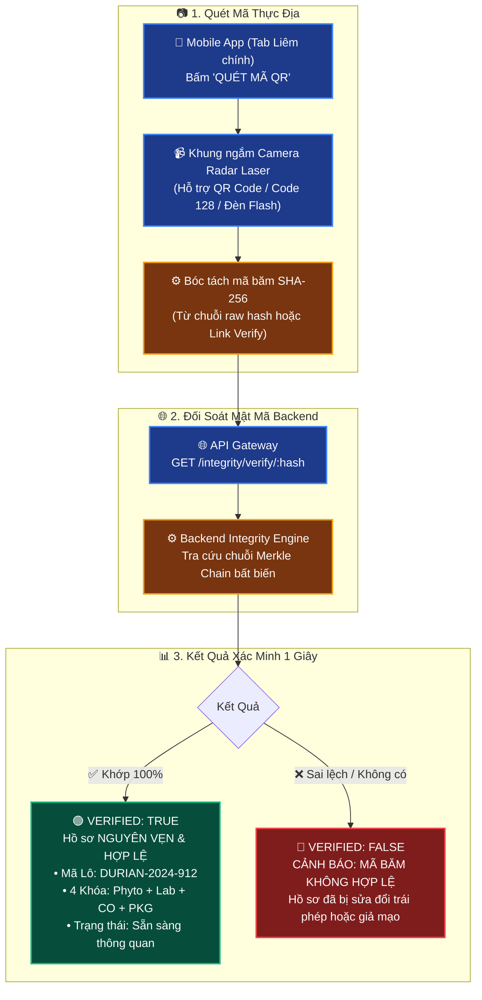

# 📱 THEMIS LEXIGUARD — ỨNG DỤNG DI ĐỘNG GIÁM SÁT XUẤT KHẨU NÔNG SẢN

> **Themis LexiGuard Mobile App** — Nền tảng Di động Giám sát & Thẩm định Tuân thủ Pháp lý Xuất khẩu Sầu riêng sang Thị trường Trung Quốc theo **Nghị định thư Hải quan GACC 2024**, **Lệnh 248/249** và **Giới hạn Kim loại nặng Cadmium GB 2762-2022**.

---

## 🌟 TỔNG QUAN HỆ THỐNG DI ĐỘNG

Ứng dụng Themis LexiGuard Mobile được thiết kế chuyên biệt cho **Cán bộ Kỹ thuật Hiện trường (Field Inspector)**, **Quản đốc Cơ sở Đóng gói (PHC Supervisor)**, **Tài xế Container** và **Cán bộ Hải quan Cửa khẩu** với 5 năng lực cốt lõi:

1. 🚨 **Ra-da Cảnh báo Sống còn Thực địa**: Giám sát tức thì nồng độ thôi nhiễm Cadmium ($\le 0.05\text{ mg/kg}$ theo GB 2762) và đồng hồ đếm ngược **14 ngày hiệu lực** của Giấy chứng nhận Kiểm dịch Thực vật (Phyto Certificate).
2. 🔑 **Hệ Sinh Thái 4 Khóa Chứng Từ (4-Key Compliance Dossier)**: Nạp và kiểm tra nhanh 4 chứng thư bắt buộc: **Phyto (Kiểm dịch TV)** + **Lab Report (Cadmium GB 2762)** + **C/O Form E (Xuất xứ hàng hóa)** + **Packing List & Xử lý dịch hại**.
3. 📷 **Camera Quét Mã QR & Barcode Chống Giả Mạo**: Sử dụng `expo-camera` nhận diện mã vạch GS1-128 và QR seal container để đối soát mã băm **SHA-256 Merkle Chain** trong 1 giây.
4. 🤖 **Trợ Lý AI Thực Địa GACC (Live Field Advisor)**: Tương tác hỏi đáp thời gian thực với AI về các quy chuẩn xuất khẩu nông sản của Hải quan Trung Quốc.
5. 🌐 **Bản Địa Hóa Đa Ngôn Ngữ 100% (Localization)**: Chuyển đổi tức thì giữa 3 ngôn ngữ: 🇻🇳 **Tiếng Việt**, 🇨🇳 **中文 (GACC Customs Standard)**, 🇬🇧 **English (International Trade)**.

---

## 📸 GIAO DIỆN 5 MÀN HÌNH CHỨC NĂNG CỐT LÕI

| 1️⃣ Điều Hành (Dashboard) | 2️⃣ Sản Phẩm & 4 Khóa | 3️⃣ Tư Vấn AI GACC |
| :---: | :---: | :---: |
|  |  |  |
| **Ra-da Cadmium & Hạn Phyto 14 ngày**<br>Lưới KPI trực quan & Lô hàng cần xử lý | **Quản lý Lô & Nạp 4 Khóa Hồ sơ**<br>Phyto + Lab + CO Form E + Packing List | **Trợ lý Pháp lý Bỏ túi**<br>Hỏi đáp Lệnh 248/249 & Nghị định thư GACC |

| 4️⃣ Liêm Chính & Quét QR | 5️⃣ Cài Đặt & Đa Ngôn Ngữ |
| :---: | :---: |
|  |  |
| **Camera Quét QR & Mã Băm SHA-256**<br>Xác thực Kẹp chì số hóa & Audit Trail Merkle | **Chuyển đổi 🇻🇳/🇨🇳/🇬🇧 & Môi trường**<br>Phân quyền RBAC & Thông tin Doanh nghiệp |

---

## 🔐 CƠ CHẾ XÁC THỰC MÃ BĂM SHA-256 & QUÉT CAMERA THỰC ĐỊA



---

## 🌐 HỆ THỐNG BẢN ĐỊA HÓA ĐA NGÔN NGỮ (LOCALIZATION ENGINE)

Ứng dụng sử dụng kiến trúc từ điển tập trung kết hợp Custom Hook phản ứng nhanh `useLocalization()` tại `mobile/src/locales/`:

```text
mobile/src/locales/
├── vi.ts             # 🇻🇳 Tiếng Việt (Thuật ngữ xuất khẩu chuẩn hóa)
├── zh.ts             # 🇨🇳 中文 (Tiêu chuẩn Hải quan GACC Trung Quốc)
├── en.ts             # 🇬🇧 English (Thương mại quốc tế)
└── index.ts          # Reactive Hook useLocalization(), setLanguage(), strings proxy
```

* **Chuyển đổi 0ms**: Người dùng bấm chọn ngôn ngữ tại tab **Cài đặt**, toàn bộ 5 tab màn hình, modal popup, thanh thông báo và camera scanner tức thì cập nhật ngôn ngữ mà **không cần reload lại ứng dụng**.
* **Zero Hardcoded Strings**: 100% chuỗi văn bản, thông báo lỗi, placeholder và trạng thái lô hàng đều được quản lý tập trung.

---

## ⚙️ CẤU TRÚC THƯ MỤC MOBILE (`mobile/`)

```text
mobile/
├── src/
│   ├── components/              # Shared UI Primitives & Modals
│   │   ├── ui.tsx               # Card, KeyBadge, StatusBadge, Skeleton, ErrorBanner
│   │   └── QrScannerModal.tsx   # CameraView QR/Barcode Scanner với Gold Radar Viewfinder
│   ├── config/
│   │   └── env.ts               # 3-Tier Environment (Development, Demo, Production)
│   ├── lib/
│   │   ├── api.ts               # Central API Client (SecureStore JWT, Bearer Token)
│   │   └── theme.ts             # Dark-Tech Navy Design Tokens (#00143B, #FFB800, #10B981)
│   ├── locales/                 # Localization Engine (vi.ts, zh.ts, en.ts, index.ts)
│   └── screens/                 # 5 Main Feature Screens
│       ├── DashboardScreen.tsx  # Ra-da Cadmium & Đếm ngược 14 ngày Phyto
│       ├── ProductsScreen.tsx   # Danh sách Lô hàng & Modal nạp 4 Khóa chứng từ
│       ├── ChecksScreen.tsx     # Trợ lý AI thực địa GACC & Lịch sử thẩm định
│       ├── IntegrityScreen.tsx  # Giám sát Liêm chính, Quét QR & Audit Log SHA-256
│       ├── SettingsScreen.tsx   # Cài đặt, Bộ chọn Ngôn ngữ & Profile RBAC
│       └── LoginScreen.tsx      # Đăng nhập bảo mật JWT & phân quyền
├── docs/                        # Tài liệu nghiệp vụ & kỹ thuật
│   ├── business.md              # Quy chuẩn 4 Khóa GACC & Ngưỡng Cadmium GB 2762
│   ├── technical.md             # Tối ưu hóa hiệu năng FlatList & Memoization
│   └── keywords-glossary.md     # Từ điển thuật ngữ pháp lý GACC
├── App.tsx                      # Root App, NavigationContainer & Bottom Tabs
├── app.json                     # Expo Application Configuration
└── package.json                 # Dependencies (Expo SDK 54, React Native 0.81)
```

---

## 🚀 HƯỚNG DẪN CÀI ĐẶT & CHẠY ỨNG DỤNG (GETTING STARTED)

### 1️⃣ Yêu cầu tiên quyết:
- **Node.js**: Phiên bản $\ge 18.0.0$
- **Ứng dụng Expo Go**: Cài đặt trên điện thoại di động (iOS từ App Store hoặc Android từ Google Play).
- **Thiết bị cùng mạng Wi-Fi/LAN** với máy tính chạy server.

### 2️⃣ Cài đặt thư viện:

```bash
cd mobile
npm install
```

### 3️⃣ Cấu hình Môi trường Kết nối (`mobile/src/config/env.ts`):

File `mobile/src/config/env.ts` hỗ trợ 3 cấu hình:
- `development`: Trỏ về IP nội bộ LAN của Backend (`http://<IP_LAN>:3001/api`).
- `demo`: Môi trường phục vụ báo cáo/thuyết trình (`http://localhost:3001/api` hoặc LAN IP).
- `production`: Cổng kết nối đám mây Cloud API.

### 4️⃣ Khởi chạy Metro Bundler:

```bash
npx expo start -c
```

### 5️⃣ Trải nghiệm trên Điện thoại:
- Mở ứng dụng **Camera** (trên iPhone) hoặc ứng dụng **Expo Go** (trên Android).
- Quét mã QR xuất hiện trên màn hình Terminal để nạp ứng dụng.
- Đăng nhập với tài khoản:
  - **Email**: `admin@themis.vn`
  - **Mật khẩu**: `Admin@123456`
  - **Đơn vị**: Công ty Cổ phần Nông nghiệp Sầu riêng Tây Nguyên (Chăm Rốch Thi - Chủ sở hữu).

---

## 🛡️ TIÊU CHUẨN MÃ NGUỒN & KIỂM THỬ (QUALITY ASSURANCE)

- **TypeScript Strict**: Đảm bảo 100% type-safe, không sử dụng `any`, không bypass kiểu dữ liệu.
  ```bash
  npx tsc --noEmit
  ```
- **Parity với Web Backend**: 100% hành động trên Mobile (Tạo lô, nạp 4 Khóa, thẩm định AI, xác thực SHA-256) đều thực hiện qua API thực, ghi nhận Database Supabase PostgreSQL và tạo bản ghi Audit Trail bất biến.
- **Production-Ready**: Không chứa mock data, không `setTimeout` giả lập trong luồng nghiệp vụ.
